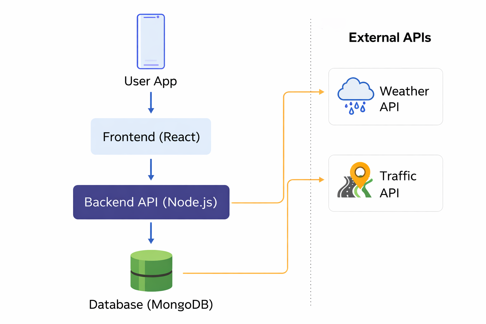
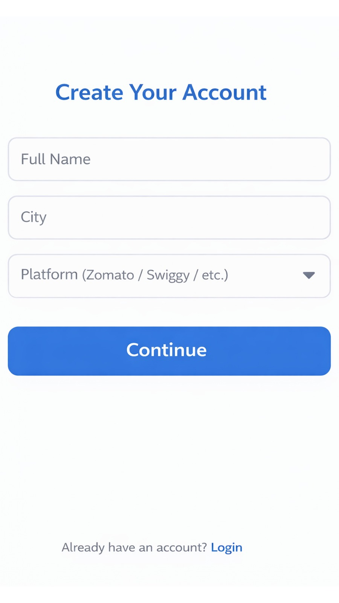
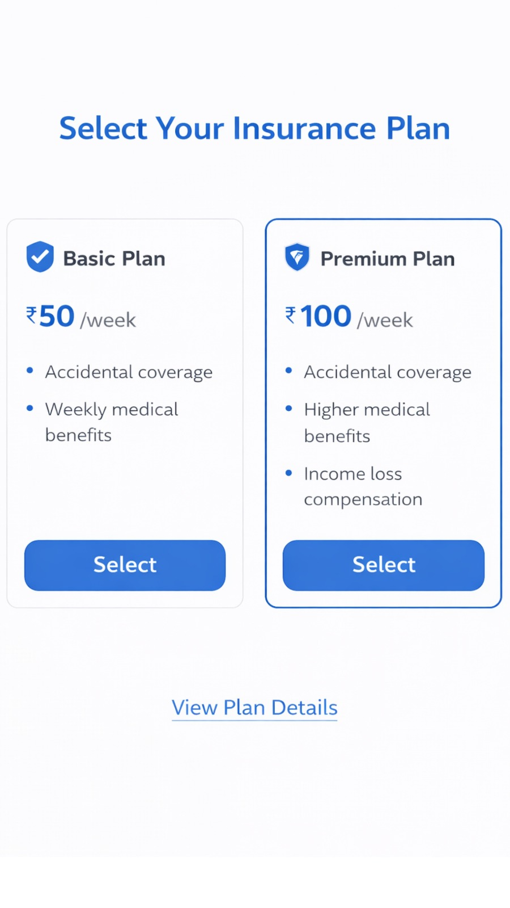
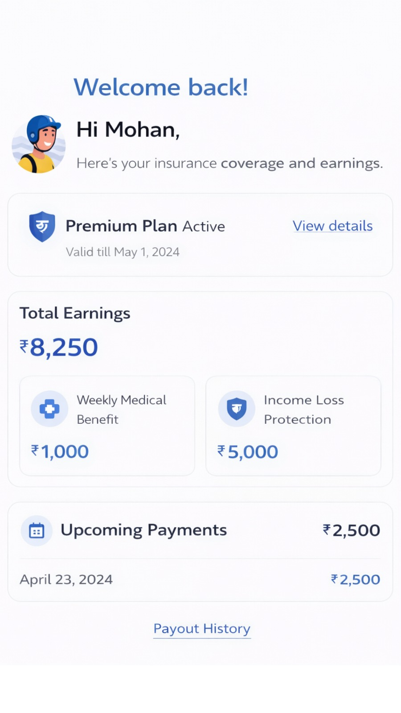

# GigShield AI
### AI-Powered Parametric Income Protection for Gig Delivery Workers

GigShield AI is an AI-driven parametric insurance platform designed to protect gig delivery partners from income loss caused by external disruptions such as extreme weather, pollution, and sudden area closures.

The platform provides automated weekly micro-insurance that compensates delivery workers when environmental disruptions prevent them from working.

---

# Problem Statement

India's gig economy depends heavily on delivery partners working with platforms such as:

- Zomato
- Swiggy
- Zepto
- Amazon
- Dunzo 

These workers rely on daily deliveries for income. However, external disruptions such as:

- Heavy rain
- Extreme heat
- Severe air pollution
- Flooding
- Sudden curfews or zone closures

can significantly reduce their working hours and earnings.

Currently, gig workers have **no protection against such uncontrollable disruptions**, which often results in 20–30% loss of their weekly income.

---

# Our Solution

GigShield AI introduces an **AI-powered parametric insurance system** that automatically compensates gig workers when disruptions occur.

The system works by:

1. Monitoring real-time environmental conditions  
2. Predicting disruption risks using AI models  
3. Triggering claims automatically when thresholds are crossed  
4. Processing instant payouts for income loss  

Unlike traditional insurance, workers **do not need to manually file claims**.

---

# Selected Persona

## Food Delivery Partners

Platforms:

- Zomato
- Swiggy

### Why Food Delivery?

Food delivery workers operate outdoors and are highly affected by environmental disruptions such as:

| Disruption | Impact |
|------------|--------|
Heavy Rain | Deliveries halted or delayed |
Extreme Heat | Unsafe working conditions |
Flooded Roads | Delivery routes blocked |
Severe Pollution | Outdoor activity reduced |

These disruptions directly reduce their working hours and earnings.

---

# Weekly Insurance Pricing Model

Gig workers operate on a **weekly earning cycle**, so GigShield AI uses a **weekly premium model**.

| Plan | Weekly Premium | Maximum Weekly Payout |
|------|---------------|-----------------------|
Basic | ₹20 | ₹500 |
Standard | ₹35 | ₹900 |
Premium | ₹50 | ₹1500 |

---

# AI-Based Dynamic Premium Calculation

Premiums are dynamically adjusted using AI models based on:

- Location  
- Historical weather patterns  
- Seasonal trends  
- Risk zones  

| Area Type | Risk Score | Weekly Premium |
|-----------|-----------|---------------|
Low Risk Zone | 0.2 | ₹20 |
Moderate Risk Zone | 0.5 | ₹30 |
High Risk Zone | 0.8 | ₹45 |

---

# Parametric Claim Triggers

| Event | Trigger Condition | Data Source |
|------|------------------|------------|
Heavy Rain | Rainfall > 70 mm | Weather API |
Extreme Heat | Temperature > 45°C | Weather API |
Severe Pollution | AQI > 400 | Air Quality API |
Flood Risk | Heavy rain + road closures | Traffic API |

**Trigger Logic:**

IF rainfall > 70mm  
AND worker location matches affected zone  
THEN claim is automatically triggered  

---

# AI Components

GigShield AI integrates AI across multiple layers:

### 1. Risk Prediction Engine
- Predicts disruption probability using weather and location data  
- Outputs a **risk score (0–1)**  

### 2. Dynamic Pricing Engine
- Adjusts weekly premium based on risk score  
- Ensures fair and scalable pricing  

### 3. Parametric Trigger Engine
- Monitors real-time data  
- Automatically triggers claims when thresholds are met  

### 4. Fraud Detection System
- Detects GPS spoofing  
- Prevents duplicate claims  
- Validates worker activity  

---

# Claim Workflow

1. Worker registers and selects weekly plan  
2. System continuously monitors environmental conditions  
3. Disruption occurs (rain, pollution, etc.)  
4. Parametric trigger activates  
5. Claim is automatically generated  
6. Fraud detection validates the claim  
7. Instant payout is processed  
8. Worker receives compensation  

---

# System Workflow

Worker Registration  
↓  
AI Risk Profiling  
↓  
Weekly Plan Selection  
↓  
Policy Activation  
↓  
Real-Time Monitoring  
↓  
Trigger Detection  
↓  
Claim Generation  
↓  
Instant Payout  

---

# Technology Stack

Frontend  
- React  
- Tailwind CSS  

Backend  
- Node.js  
- Express.js  

Database  
- MongoDB  

Machine Learning  
- Python  
- Scikit-learn  

External APIs  
- Weather API  
- Traffic API  
- Air Quality API  

---

# Architecture Diagram

---

# Prototype Screens

### Landing Page

### Signup Page

### Plan Selection

### Dashboard

---

# Development Roadmap

## Phase 1 – Seed
- Idea validation  
- Prototype design  
- Architecture definition  

## Phase 2 – Scale
- User system  
- Policy management  
- Trigger automation  

## Phase 3 – Soar
- Fraud detection  
- Instant payouts  
- Predictive analytics  

---

# Expected Impact

### For Gig Workers
- Income protection  
- Weekly affordable insurance  
- Automatic payouts  

### For Insurers
- Reduced fraud  
- Predictive analytics  
- Scalable insurance model  

---

---

# Adversarial Defense & Anti-Spoofing Strategy

## The Threat Scenario

GigShield AI operates in an environment where coordinated fraud attacks can exploit parametric insurance systems.

Example attack:

- Fake GPS spoofing by multiple delivery partners  
- No real disruption, but claims triggered artificially  
- Coordinated claim submissions draining payout pool  

This creates a "Market Crash" scenario where fraudulent actors exploit automated systems.

---

## Our Defense Philosophy

GigShield AI follows a **multi-layered defense approach**:

1. **Trust Scoring instead of binary validation**
2. **Cross-verification using multiple data sources**
3. **Behavioral anomaly detection**
4. **Group fraud detection (fraud rings)**
5. **Fairness-first approach to protect honest workers**

---

## 1. Multi-Signal Location Verification

Instead of relying only on GPS, the system validates location using:

- GPS coordinates
- Network/IP location consistency
- Historical movement patterns
- Platform activity logs (mock delivery activity)

### Logic:

If GPS shows presence in a flooded zone  
BUT no movement history OR inconsistent IP location  
→ Flag as suspicious

---

## 2. Activity-Based Validation

A genuine worker affected by disruption shows:

- Reduced or zero delivery activity  
- Gradual drop in movement before disruption  
- Consistent location behavior  

### Fraud Pattern:

- Sudden inactivity without prior activity pattern  
- Claims without active delivery history  

### Rule:

IF no delivery activity recorded in past time window  
AND claim triggered  
→ Increase fraud risk score

---

## 3. Environmental Correlation Engine

Claims must match real-world conditions.

System verifies:

- Weather severity in exact micro-location  
- Traffic congestion data  
- Road closure reports  

### Rule:

IF user claims heavy rain disruption  
BUT weather API shows normal conditions  
→ Reject or flag claim

---

## 4. Fraud Ring Detection (MOST IMPORTANT)

Fraud rarely happens individually — it happens in groups.

The system detects:

- Multiple claims from same location cluster  
- Same time window claims from unrelated users  
- Identical behavior patterns  

### Example Pattern:

- 50 users claim disruption in same zone  
- But platform activity shows deliveries still happening  

### Action:

- Cluster flagged as "suspicious group"  
- Claims moved to verification queue  

---

## 5. Behavioral Anomaly Detection

Each worker has a baseline profile:

- Average working hours  
- Normal delivery zones  
- Activity frequency  

### Suspicious Behavior:

- Sudden change in working location  
- Unusual claim frequency  
- Repeated claims during high-risk events  

### Output:

Each user gets a **Fraud Risk Score (0–1)**

---

## 6. Trust Score System

Instead of blocking instantly, GigShield AI uses a trust score.

| Score | Action |
|------|--------|
0.0 – 0.3 | Auto payout |
0.3 – 0.7 | Delayed payout + verification |
0.7 – 1.0 | Flag for manual review |

---

## 7. Fairness Mechanism (Critical)

To avoid penalizing genuine workers:

- First claim is always leniently evaluated  
- Small payouts auto-approved even if risk is moderate  
- Only repeated suspicious behavior triggers strict checks  

---

## 8. Rate Limiting & Payout Protection

To prevent system drain:

- Maximum payout cap per zone per time window  
- Dynamic throttling during extreme claim spikes  

---

## 9. Continuous Learning Loop

The system improves over time:

- Fraud cases feed into ML models  
- Patterns are updated dynamically  
- Risk scoring becomes more accurate  

---

## Final Outcome

GigShield AI ensures:

- Fraudulent claims are detected early  
- Coordinated fraud rings are neutralized  
- Honest workers receive uninterrupted payouts  

The system balances **security + fairness**, ensuring trust in the platform while maintaining financial sustainability.

## Demo Video

[Watch Demo](https://youtu.be/_5AzLYDxDpo?si=qK0HO5rPowh9zwNh)

---
